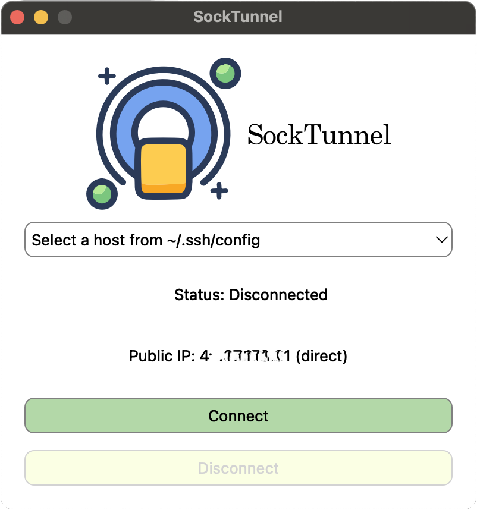

# SockTunnel

A modern Qt-based SOCKS proxy launcher with system proxy integration. Easily tunnel your traffic over SSH with a beautiful GUI.

[](https://opensource.org/licenses/MIT)

---

## 🚀 What is SockTunnel?

**SockTunnel** is a sleek, cross-platform desktop application built using **Qt (C++17)** to help you:

- 🔐 Securely tunnel your internet traffic using **SSH SOCKS5 proxy**
- 🌍 Instantly verify your **public IP before and after** tunneling
- 🧠 Auto-detect hosts from `~/.ssh/config` for easy selection
- 🖥️ Seamlessly **update system proxy settings** (macOS & Linux)
- 🎨 Enjoy a clean and minimal UI

---

## 🎯 Key Features

- ✅ GUI for launching `ssh -D` tunnels without touching the terminal
- ✅ Shows public IP **before and after** tunnel activation
- ✅ Compatible with any `~/.ssh/config` entries
- ✅ Auto-selects available local ports for proxy binding
- ✅ System-wide proxy toggle (macOS/Linux)
- ✅ Built with **Qt6**, fully open source

---

## 🖼️ Screenshots



---

## 🛠️ Build Instructions

### 📦 Requirements

- Qt 6.x (Widgets, Network, SvgWidgets, DBus)
- CMake >= 3.16
- C++17 compatible compiler

### 🔧 Build (macOS)

```bash
git clone https://github.com/shubhamoy/SockTunnel.git
cd socktunnel
mkdir build && cd build
cmake ..
cmake --build .
open SockTunnel.app